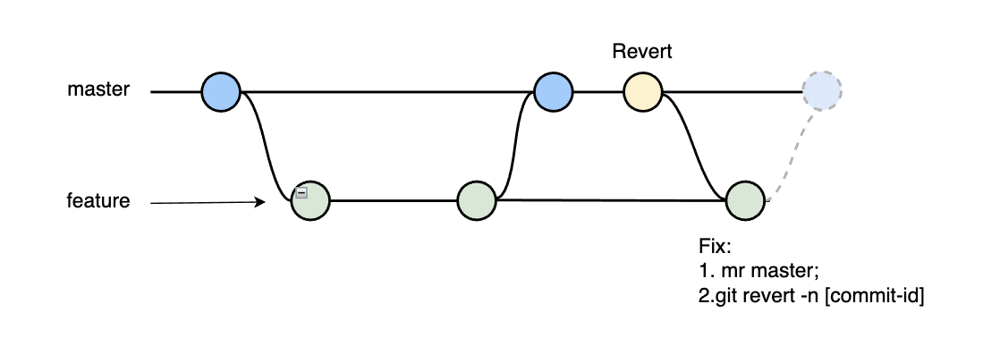

# 代码回滚场景梳理


- **git revert**: 回滚到对应的commit-id，默认情况下回滚会产生一条新的记录。
- **git reset**: 撤销指定commit-id，重新生成一个commit-id，执行git push推送到远程，不会对其他的commit-id造成影响。


### 场景1：



- Feature 开发代码
- Master Merge Feature
- Feature Merge Master

#### 结果
 Master回滚Feature，Feature Merge Master，Feature之前修改的代码会没有
 
#### 解决

Feature revert 到指定commit-id 再合并

#### 如何回滚merge的分支

Master

```bash
// 查看提交记录
git log 
// Revert Master合并
git revert -m 1 [commit-id]
// 假设在master分支
// -m 1 是master（当前分支）
// -m 2 是另外一个分支

// 推到远程分支，有冲突，先解决
git push
```

Feature

```bash
// 合并master到开发分支
git merge master
// 回滚master回滚的代码，解决合并revert代码之后开发分支代码没有的问题
git revert -n [commit-id]
// -n参数可以避免再次产生一条提交记录
```

TODO:

git revert merge分支，需要加-m选择保留哪个分支的信息，否则会报以下错误：

```bash
error: commit xxx is a merge but no -m option was given.
fatal: revert failed
```

### 场景2：

开发者A：
- 合并分支A

开发者B：
- 合并分支B

突然发现，开发者A和开发者B在开发同个项目，都同时合并到Master，需要将B回滚。

#### 回滚多次revert


