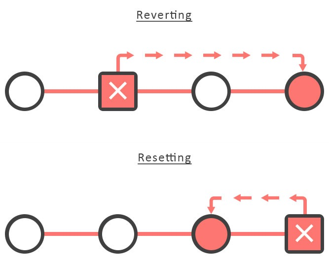

# 代码回滚场景梳理



- **git revert**: 回滚到对应的commit-id，默认情况下回滚会产生一条新的记录。
- **git reset**: 撤销指定commit-id，重新生成一个commit-id，执行git push推送到远程，不会对其他的commit-id造成影响。


#### 场景1：

- D：修改代码
- M Merge D
- D Merge M

#### 结果
 M回滚D，D Merge M, D之前修改的代码会没有
 
#### 解决

D revert 到指定分支 再合并

#### 如何回滚merge的分支


```bash

git log // 查看提交信息
git revert n


```

#### 场景步骤复现2：

开发者A：
- 合并分支A

开发者B：
- 合并分支B

突然发现，开发者A和开发者B在开发同个项目，都同时合并到Master，需要将B回滚。

#### 回滚多次revert


