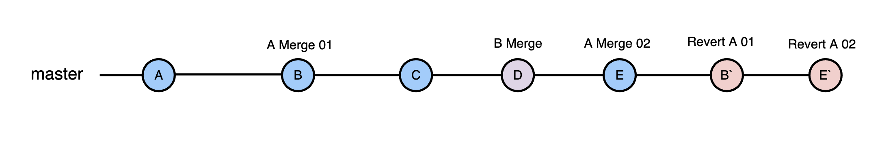
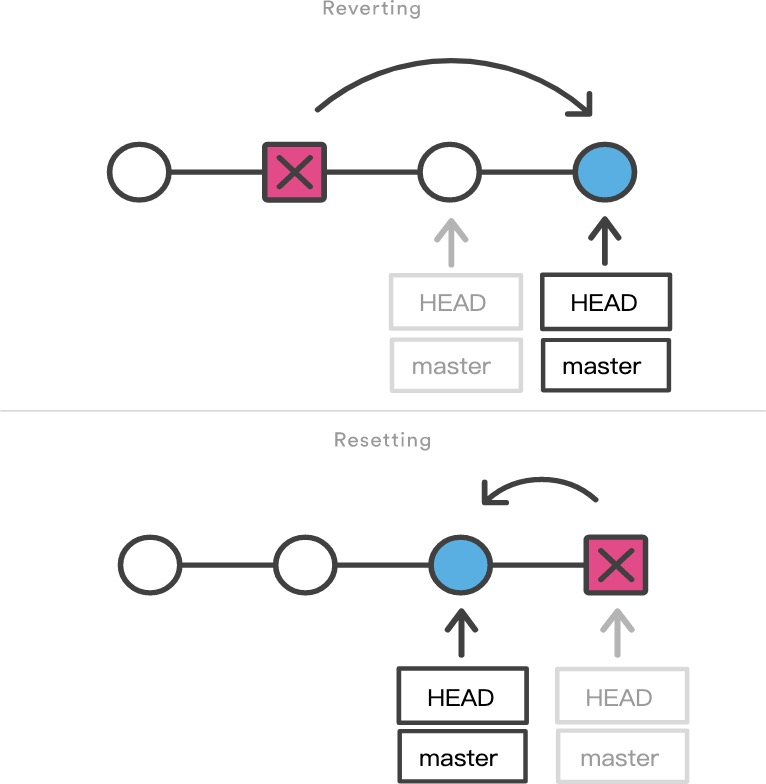

# 代码Revert场景梳理


- **git revert**回滚到对应的commit-id，默认情况下回滚会产生一条新的记录。
- **git revert**是用一次新的commit来回滚之前的commit
- **git reset**撤销指定commit-id，重新生成一个commit-id，执行git push推送到远程，不会对其他的commit-id造成影响。
- **git reset**是直接删除指定的commit。**git reset**是把HEAD向后移动了一下，而**git revert**是HEAD继续前进，只是新的commit的内容和要revert的内容正好相反，能够抵消要被revert的内容
- 如果回退分支的代码以后还需要的情况则使用**git revert**， 如果分支是提错了没用的并且不想让别人发现这些错误代码，则使用**git reset**

### 场景1：


- Feature 开发代码
- Master Merge Feature
- Feature Merge Master

#### 结果
 Master回滚Feature，Feature Merge Master，Feature之前修改的代码会没有
 
#### 解决

Feature revert 到指定commit-id 再合并

#### 如何回滚merge的分支

Master

```bash
// 查看提交记录
git log 
// Revert Master合并
git revert -m 1 [commit-id]
// 假设在master分支
// -m 1 是master（当前分支）
// -m 2 是另外一个分支

// 推到远程分支，有冲突，先解决
git push
```

Feature

```bash
// 合并master到开发分支
git merge master
// 回滚master回滚的代码，解决合并revert代码之后开发分支代码没有的问题
git revert -n [commit-id]
// -n参数可以避免再次产生一条提交记录
```

### 场景2：



开发者A：
- 合并分支A

开发者B：
- 合并分支B

突然发现，开发者A和开发者B在开发同个项目，都同时合并到Master，需要将A回滚。

#### 回滚多次revert

Master

找到A分支的两次合并进行revert

```bash
git revert -m 1 [分支A的第一次commit-id]
git revert -m 1 [分支A的第二次commit-id]
```

Feature A 

```bash
git revert -n [revert master revert分支A的第一次commit-id]
git revert -n [revert master revert分支A的第二次commit-id] 
```

### 使用reset撤销代码

```bash
git reset --hard [commit-id]
git push -f // 强制推送
```

### 扩展知识

#### 1. git revert merge分支，需要加-m选择保留哪个分支的信息，否则会报以下错误：

```bash
error: commit xxx is a merge but no -m option was given.
fatal: revert failed
```

#### 2. HEAD的理解



HEAD指针指向当前分支（只有一个分支的情况下会指向master，而master是指向最新提交）.

```bash
// 撤销前一个版本
git revert/reset HEAD
// 撤销前前一个版本
git revert/reset HEAD^
```

#### 3.git revert解释
```bash
git revert --help
```

### 参考文献
- [面试官：说说你对Git Reset 和 Git Revert 的理解？区别？](https://www.51cto.com/article/678497.html)
- [Git：git-revert的用法总结](https://blog.csdn.net/chaiyu2002/article/details/81181134?utm_medium=distribute.pc_aggpage_search_result.none-task-blog-2~aggregatepage~first_rank_ecpm_v1~rank_v31_ecpm-2-81181134.pc_agg_new_rank&utm_term=git+revert%E5%8F%82%E6%95%B0&spm=1000.2123.3001.4430)
- [Git恢复之前版本的两种方法reset、revert（图文详解）](https://blog.csdn.net/yxlshk/article/details/79944535)


